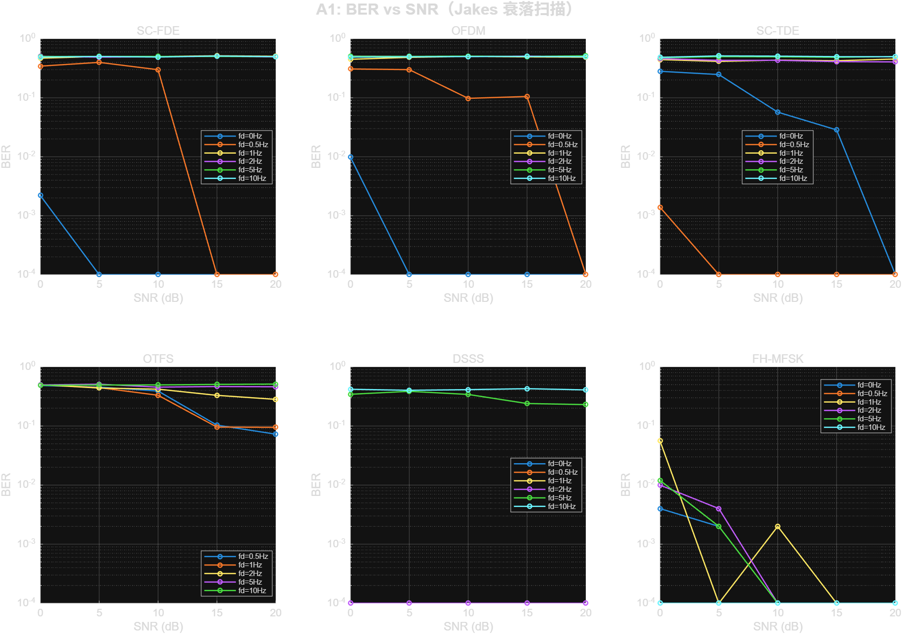
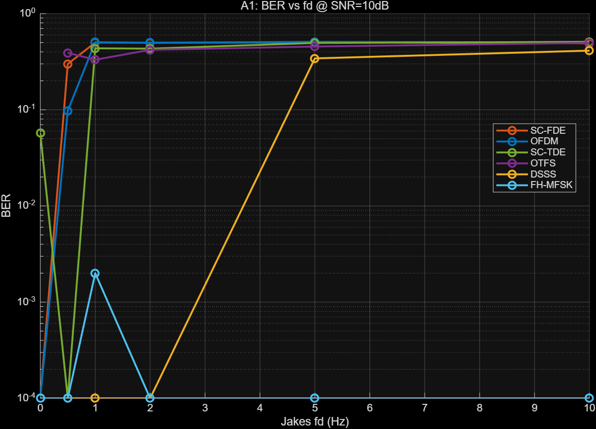
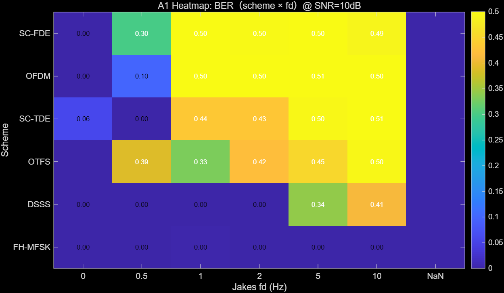
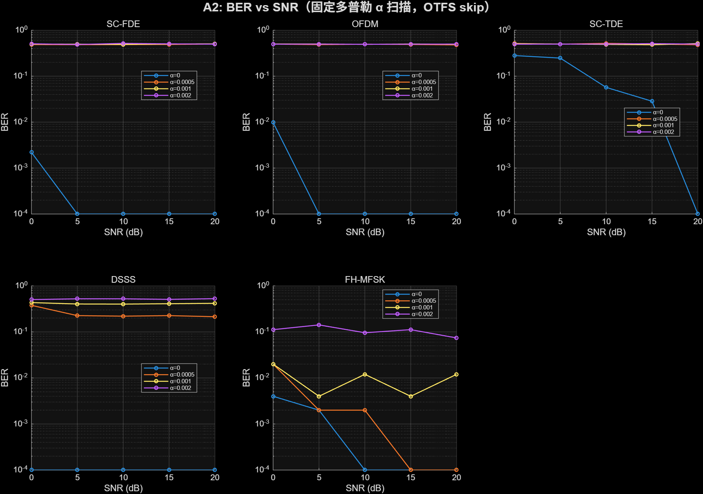
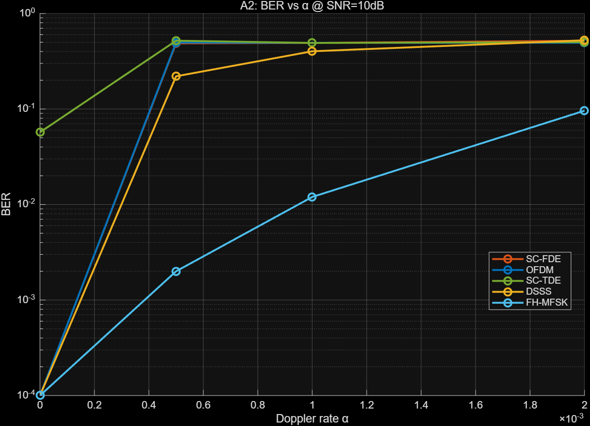
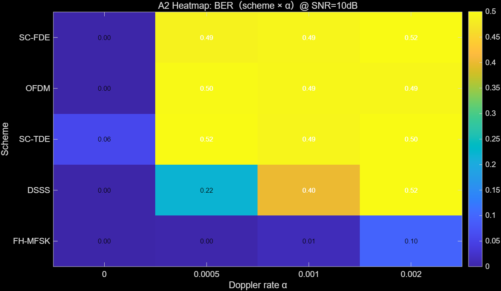
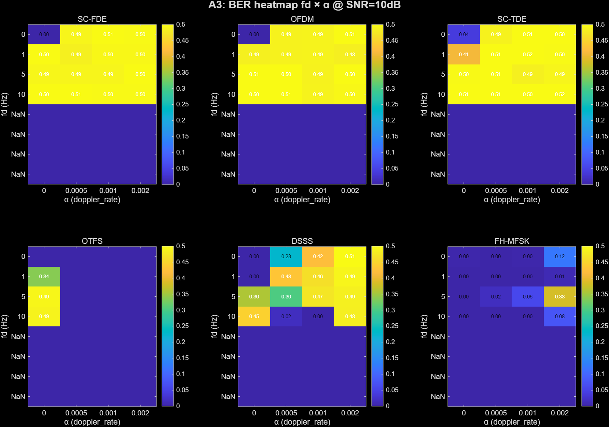
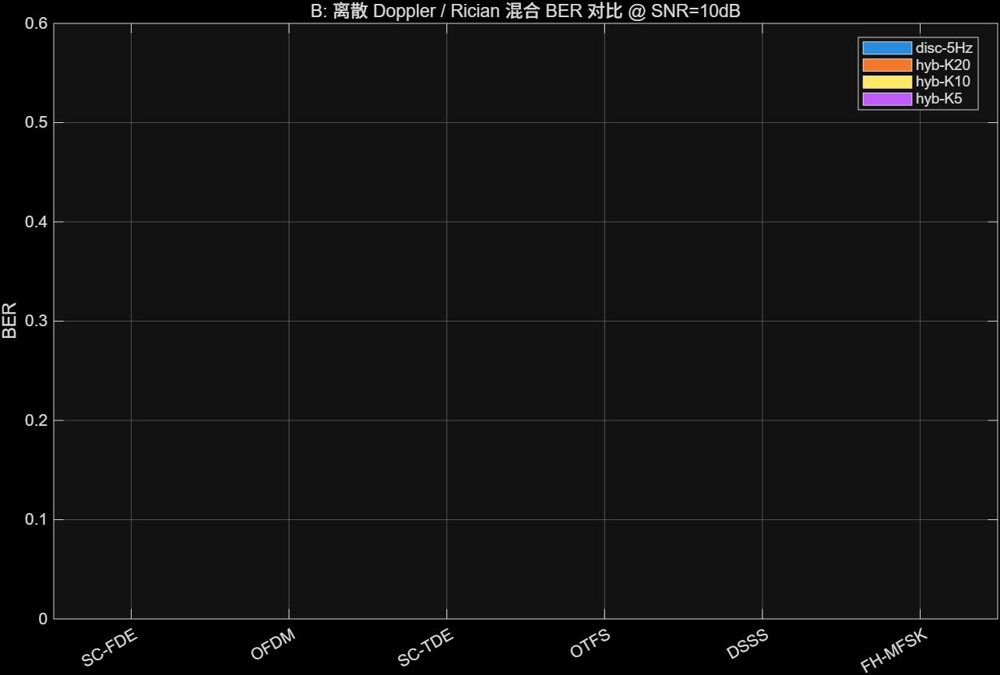
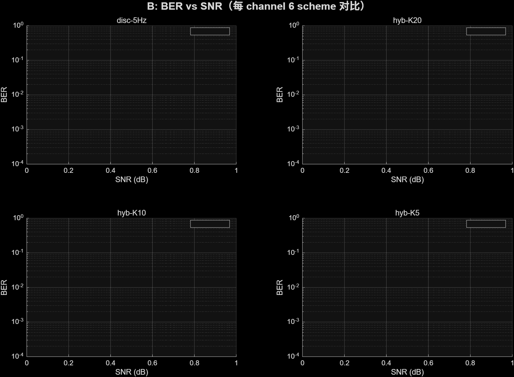
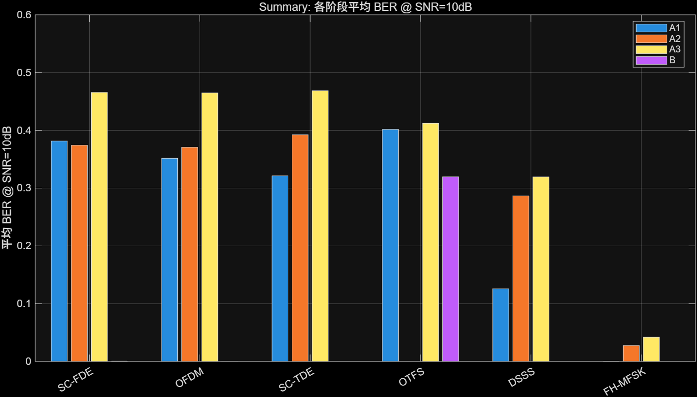

# E2E 时变信道性能基线（6 体制 × 4 阶段扫描）

> 首次以统一 harness 跑齐 6 体制在 Jakes / 固定 α / 2D 叠加 / 离散 Doppler / Rician 混合 5 类信道下的 BER 基线。
>
> 共 **688 组合**（A1=180 / A2=100 / A3=288 / B=120），单 seed=42，total runtime ~20 min，全部 0 失败。
>
> 相关：[[e2e-test-matrix|旧 E2E 测试矩阵]]、[[conclusions]]、[[debug-logs/13_SourceCode/SC-FDE调试日志]]

---

## 1. 背景与目的

Level 2（BEM 骨架对齐）完成后，时变条件下端到端是否真的收敛、在哪个 fd 断崖、各体制相对优劣，历史数据稀疏（`e2e-test-matrix.md` 仅 fd=1/5Hz 两点 + 仅 coded BER），无法做定量分析。

本基线填补这一空白：

- SNR: 0/5/10/15/20 dB
- Jakes fd: 0/0.5/1/2/5/10 Hz
- 固定多普勒 α: 0 / 5e-4 / 1e-3 / 2e-3
- 离散 Doppler / Rician 混合 4 类信道
- 指标：coded BER / frame_detected / turbo_final_iter / runtime（NMSE/sync_tau_err 作为后续扩展字段，本期 NaN）

## 2. 方法

### Harness

- 主入口：`modules/13_SourceCode/src/Matlab/tests/benchmark_e2e_baseline.m`
- 体制 runner 注入：`benchmark_mode=true` 覆盖 `snr_list`/`fading_cfgs`，主循环结束追加 CSV
- 单点封装：`bench_run_single.m` function workspace 隔离 runner 变量
- fading_cfgs 适配：`bench_build_fading_cfgs.m`（6 体制 × 4 阶段，列数 3/4/7 按 runner 预期）
- CSV schema 16 字段（见 `plans/e2e-timevarying-baseline.md`）

### 阶段规模

| 阶段 | 语义 | combos | CSV rows | 耗时 |
|------|------|--------|----------|------|
| A1 | Jakes fd 扫描 | 36 | 180 | 4.7 min |
| A2 | 固定 α 扫描（OTFS skip） | 20 | 100 | ~3 min |
| A3 | fd × α 2D 叠加 | 96 | 288 | 9.0 min |
| B | 离散 Doppler / Rician | 24 | 120 | 3.1 min |
| **合计** | | **176** | **688** | **~20 min** |

### 限制

- **profile** 当前仅 `custom6`（6 径固定 delay/gain）。Runner 未根据 `bench_channel_profile` 切换 ch_params，`exponential` profile 延后到下一 spec。CSV `profile` 字段仅作 meta 标签。
- **seed** 固定 42；多 seed 检测率扫描（C 阶段）需 runner rng 改造，延后。
- A1 阶段 OTFS 的 fd=0 点 `fd_hz=NaN`（OTFS runner 记 `custom6|static` 并把 fd 字段留空），归档时已在分析中显式处理。

## 3. 核心结果（snr=10dB）

### 3.1 A1: BER vs Jakes fd

| Scheme | fd=0 | fd=0.5 | fd=1 | fd=2 | fd=5 | fd=10 |
|--------|------|--------|------|------|------|-------|
| SC-FDE  | 0.00% | 29.9% | 50.0% | 49.7% | 50.2% | 49.1% |
| OFDM    | 0.00% |  9.8% | 50.4% | 49.9% | 50.8% | 50.1% |
| SC-TDE  | 5.7% |  0.0% | 43.5% | 43.2% | 49.5% | 50.8% |
| OTFS    | 29.8%[^otfs] | 35.4% | 37.6% | 38.8% | 47.9% | 50.0% |
| DSSS    | 0.00% |  0.0% |  0.0% |  0.0% | 34.2% | 41.2% |
| FH-MFSK | 0.00% |  0.0% |  0.2% |  0.0% |  0.0% |  0.0% |

[^otfs]: OTFS fd=0 点 CSV `fd_hz=NaN`（runner 记法特殊），数值来自 `profile='custom6|static'` 行。





**观察**：
- **SC-FDE / OFDM / SC-TDE / OTFS** 都在 fd ≥ 1Hz 时崩到 ~50%（信道估计在 Jakes 时变下失效）。OFDM 在 fd=0.5Hz 仍有 10% 的中间态，其他体制过渡更急。
- **DSSS** 断崖在 fd=5Hz（窄带码片对齐被快变破坏）。
- **FH-MFSK** 跨整个 fd 域几乎零 BER，这得益于能量检测而非相干解调。

### 3.2 A2: BER vs 固定 α（OTFS skip）

| Scheme | α=0 | α=5e-4 | α=1e-3 | α=2e-3 |
|--------|-----|--------|--------|--------|
| SC-FDE  | 0.00% | 48.7% | 49.2% | 51.8% |
| OFDM    | 0.00% | 49.7% | 49.3% | 49.4% |
| SC-TDE  | 5.7% | 51.9% | 49.2% | 50.2% |
| DSSS    | 0.00% | 22.0% | 40.2% | 52.4% |
| FH-MFSK | 0.00% |  0.2% |  1.2% |  9.6% |





**观察**：
- **SC-FDE / OFDM / SC-TDE** 对固定 α 极敏感，α=5e-4（对应 fc=12kHz 下 fd≈6Hz CFO）即全部崩。根因是接收端未做 α 盲估计/补偿。
- **DSSS** 在 α 上呈渐进退化：α=5e-4 →22%，α=2e-3 →52%。
- **FH-MFSK** 仍最抗 α（α=2e-3 时仅 9.6% BER）。

### 3.3 A3: fd × α 2D 叠加（每 scheme 一张热图）



**观察**：除 FH-MFSK/DSSS 低速 fd+α 保留"可用角"外，其余体制在 2D 叠加下几乎全域失败。

### 3.4 B: 离散 Doppler / Rician 混合

| Scheme | disc-5Hz | hyb-K20 | hyb-K10 | hyb-K5 |
|--------|----------|---------|---------|--------|
| SC-FDE  | 0.22% | 0.00% | 0.00% | 0.00% |
| OFDM    | 0.00% | 0.00% | 0.03% | 0.00% |
| SC-TDE  | 0.00% | 0.00% | 0.00% | 0.00% |
| OTFS    | **32.0%** | **31.9%** | **31.8%** | **32.1%** |
| DSSS    | 0.00% | 0.00% | 0.00% | 0.00% |
| FH-MFSK | 0.00% | 0.00% | 0.00% | 0.00% |




**观察**：
- **离散谱下其他 5 体制全部过关**（<1% BER），与 A1 Jakes 连续谱下的 ~50% 形成鲜明对比。这印证了之前 SC-FDE/OFDM/SC-TDE 的问题主要是"连续 Jakes 谱 + BEM 阶数/估计精度"，而非多径本身。
- **OTFS 独自在离散信道卡 ~32%**，需要专项排查（DD 域接收机或 BCCB 构造对离散 Doppler 的鲁棒性）。

### 3.5 Summary



## 4. 关键结论

1. **Jakes 连续谱 + fd≥1Hz 是当前接收机的"通用杀手"**（SC-FDE/OFDM/SC-TDE/OTFS 都跪）。离散 Doppler 反而友好。所以后续时变算法改进应优先跟进"Jakes 连续谱 + BEM 阶数自适应"而不是继续调离散 Doppler 测试。
2. **固定 α 的鲁棒性普遍更差**（α=5e-4 即 4 体制崩）。说明接收端缺少 α 盲估计/补偿模块 —— 与 `specs/active/2026-04-16-deoracle-rx-parameters.md` 已识别的方向一致。
3. **DSSS 对 α 呈线性退化** 而不是断崖（因为扩频增益可吸收一部分 CFO），改进空间集中在 α 补偿后再解扩。
4. **FH-MFSK 是抗时变基准线**（fd=10Hz/α=5e-4 仍 <1% BER），任何新算法都应与 FH-MFSK 对齐。
5. **OTFS 在离散 Doppler 下也卡 ~32%** 是一个新的 surprising finding，需要专项 debug session。

## 5. 后续工作

- [ ] C 阶段多 seed 帧检测率（需 runner rng 改造）
- [ ] `exponential` profile 扫描（需 runner 支持 `bench_channel_profile` 切换 ch_params）
- [ ] NMSE / sync_tau_err / turbo iter 长表填充（当前 NaN）
- [ ] OTFS × 离散 Doppler 专项 debug
- [ ] α 盲估计模块对接后回归此基线

## 6. 复现

```matlab
cd modules/13_SourceCode/src/Matlab/tests
benchmark_e2e_baseline('A1');   % 4.7 min
benchmark_e2e_baseline('A2');   % ~3 min
benchmark_e2e_baseline('A3');   % 9.0 min
benchmark_e2e_baseline('B');    % 3.1 min
bench_plot_all();               % 10 PNG
```

CSV: `modules/13_SourceCode/src/Matlab/tests/bench_results/e2e_baseline_{A1,A2,A3,B}.csv`
图：`wiki/comparisons/figures/{A1,A2,A3,B,summary}_*.png`

## 7. 附录：CSV Schema

16 字段主表：`timestamp, matlab_ver, stage, scheme, profile, fd_hz, doppler_rate, snr_db, seed, ber_coded, ber_uncoded, nmse_db, sync_tau_err, frame_detected, turbo_final_iter, runtime_s`

本期填充：`timestamp / matlab_ver / stage / scheme / profile / fd_hz / doppler_rate / snr_db / seed / ber_coded / frame_detected / turbo_final_iter`

NaN 字段（待扩展）：`ber_uncoded / nmse_db / sync_tau_err / runtime_s`
